<div align="center">

<!-- Animated Header Banner -->


<br/>

<!-- Typing Animation -->
<a href="https://github.com/Yossy123">
  
</a>

</div>

<br/>

---

## `> whoami`

```python
class Yossy123:
    name       = "Yossy Kusuma"
    alias      = "Yossy123"
    role       = "Fullstack Web Developer & AI Business Automation"
    location   = "Indonesia 🇮🇩"
    languages  = ["PHP", "JavaScript", "TypeScript", "Python", "HTML", "CSS", "SQL"]
    learning   = ["Laravel", "React", "Tailwind CSS", "Full Stack", "n8n Automation"]
    interests  = ["AI", "Business Automation", "Web Dev", "Open Source"]
    contact    = "yossykusuma01@gmail.com"

    def greet(self):
        return "Thanks for visiting! Let's build something awesome together 🚀"
```

---

## `> tech.stack --all`

<div align="center">

### Languages & Frameworks

<a href="https://github.com/Yossy123">
  
</a>

<br/><br/>

### Frontend

<a href="https://github.com/Yossy123">
  
</a>

<br/><br/>

### Backend & Database

<a href="https://github.com/Yossy123">
  
</a>

<br/><br/>

### Tools & Platforms

<a href="https://github.com/Yossy123">
  
</a>

<br/><br/>

### AI & Automation


</div>

---

## `> github.stats --detailed`

<div align="center">

<table>
  <tr>
    <td align="center" width="50%">
      
    </td>
    <td align="center" width="50%">
      
    </td>
  </tr>
</table>

<br/>


<br/><br/>


</div>

---

## `> achievements.trophy --display`

<div align="center">


</div>

---

## `> contribution.snake --animate`

<div align="center">

<picture>
  <source media="(prefers-color-scheme: dark)" srcset="https://raw.githubusercontent.com/Yossy123/Yossy123/output/github-snake-dark.svg"/>
  <source media="(prefers-color-scheme: light)" srcset="https://raw.githubusercontent.com/Yossy123/Yossy123/output/github-snake.svg"/>
  
</picture>

</div>

---

## `> connect --social`

<div align="center">

<a href="https://github.com/Yossy123">
  
</a>
&nbsp;
<a href="mailto:yossykusuma01@gmail.com">
  
</a>

<br/><br/>


<br/>

```
╔═══════════════════════════════════════════════════╗
║   ⚡ Built with passion, powered by curiosity ⚡  ║
╚═══════════════════════════════════════════════════╝
```

</div>
