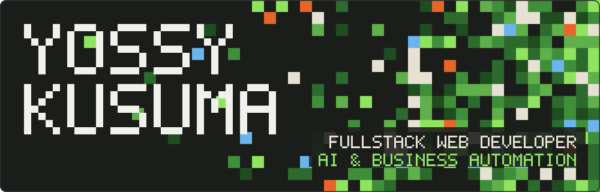
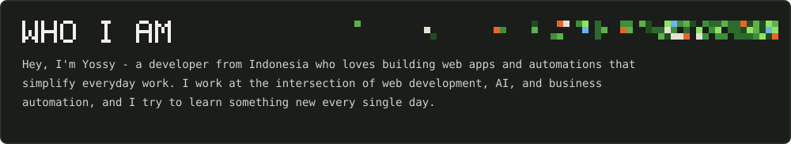
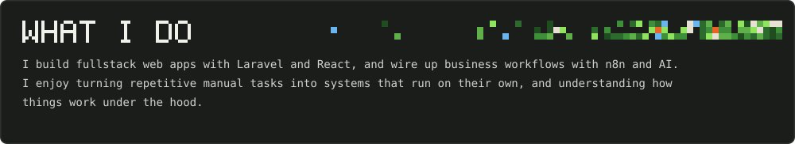
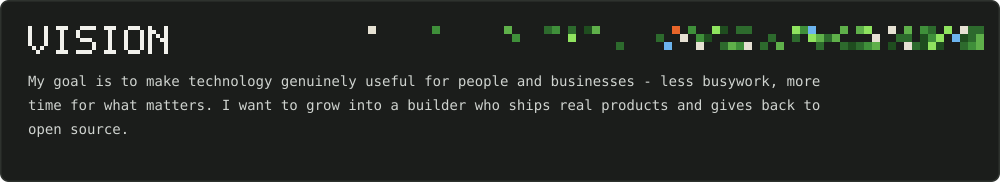
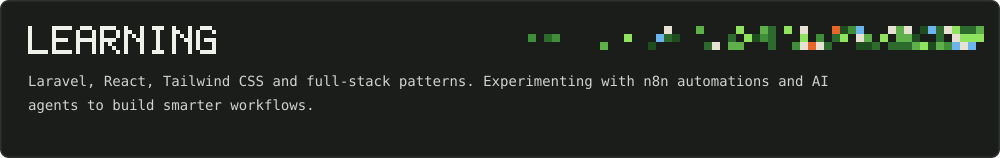
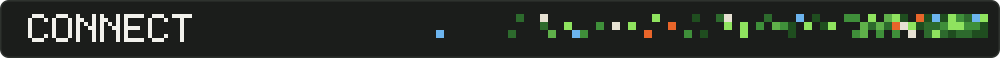
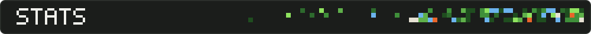
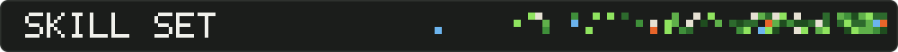

  

 

<table>
  <tr>
    <th width="140">GitHub</th>
    <th width="140">Gmail</th>
  </tr>
  <tr>
    <td align="center"></td>
    <td align="center"></td>
  </tr>
</table>

<picture>
  <source media="(prefers-color-scheme: dark)" srcset="https://raw.githubusercontent.com/Yossy123/Yossy123/output/profile-3d-contrib/profile-night-view.svg"/>
  
</picture>

<picture>
  <source media="(prefers-color-scheme: dark)" srcset="https://raw.githubusercontent.com/Yossy123/Yossy123/output/github-snake-dark.svg"/>
  <source media="(prefers-color-scheme: light)" srcset="https://raw.githubusercontent.com/Yossy123/Yossy123/output/github-snake.svg"/>
  
</picture>

<table>
  <tr>
    <td align="center" width="110"> HTML</td>
    <td align="center" width="110"> CSS</td>
    <td align="center" width="110"> JavaScript</td>
    <td align="center" width="110"> TypeScript</td>
    <td align="center" width="110"> PHP</td>
    <td align="center" width="110"> Python</td>
    <td align="center" width="110"> Go</td>
  </tr>
  <tr>
    <td align="center"> React</td>
    <td align="center"> Tailwind</td>
    <td align="center"> Laravel</td>
    <td align="center"> Node.js</td>
    <td align="center"> MySQL</td>
    <td align="center"> PostgreSQL</td>
    <td align="center"> n8n</td>
  </tr>
  <tr>
    <td align="center"> OpenAI</td>
    <td align="center"> Git</td>
    <td align="center"> GitHub</td>
    <td align="center"> VS Code</td>
    <td align="center"> Linux</td>
    <td align="center"></td>
    <td align="center"></td>
  </tr>
</table>

 

Thanks for stopping by. Let's build something together 🚀

